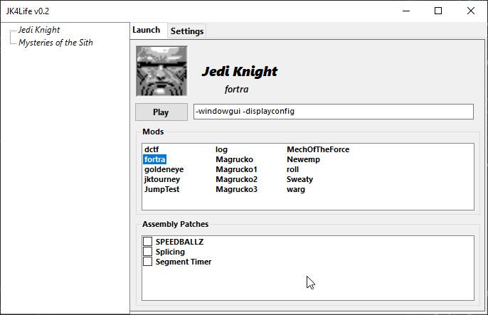

# JK4Life v0.2
#### A launcher and [patcher](https://github.com/OCircles/JK4Life/wiki/Assembly-Patches) for Jedi Knight / Mysteries of the Sith

In it's current state this is very barebones, but I wanted to put it out anyway just so people could get access to the assembly patches that you can do with this. There's a lot more to be added, so stay tuned for that! For now I'll keep it somewhat mysterious, but trust me it'll be super cool ;)

#### PS: The patching is never done on your original file, it makes a copy

---

## Near future

Groundwork is done for future **secret** features!

* UI
  * Logo / icon
  * Hide tabs, replace with header
  * Traybar bubbles for the first **secret** feature

* Settings
  * New UserControl for settings in the same vein as Launch tab

* Mods
  * Option to recursively check through mod folders
  * Option to use file system watcher on the mod folders to automatically refresh on changes